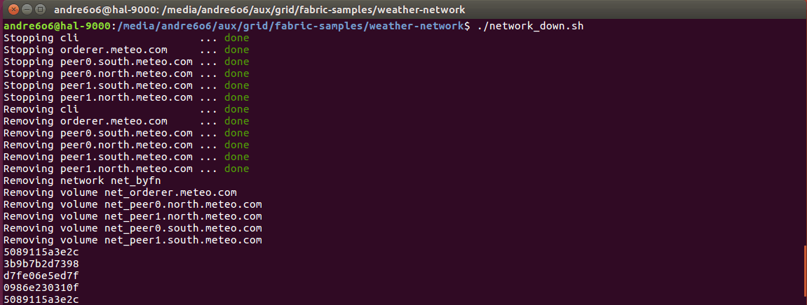

# fabric-weather
Distributed weather station modelled in hyperledger fabric.

[Check presentation for task details.](https://docs.google.com/presentation/d/e/2PACX-1vSD2ynCXTRIhzSIm0LrA-__1AiRCSmVheJNFeABG_GciVWIj_cGOBsHQS3GF7q85CSFzAbksP98a72l/pub?start=false&loop=false&delayms=3000)

Course project for course "Grid basics and Cloud computing".

## Pre-requisite
Prerequisites for Hyperledger Fabric:
* cURL
* Docker
* Docker-compose
* Go

Download Binaries and Docker Images for Hyperledger Fabric using script:
```bash
./scripts/bootstrap.sh
```
(honestly, might not work so consider cloning [this repo](https://github.com/hyperledger/fabric-samples) and moving *weather-network* and *chaincode* there)

## Network
Network looks like this:


## Usage
This script will bring network up, install chaincode on it's nodes and do testing:
```bash
./weather-network/network_up.sh
```
The output will be:


This test code will measure temperature t1 on peer0.north, then measure temperature t2 on peer0.south, then "forecast" average temperature on nodes peer1.north and peer1.south.

To bring network down:
```bash
./weather-network/network_down.sh
```


